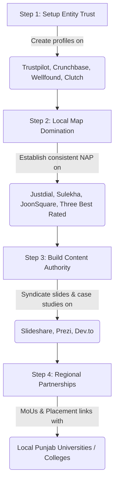

# Competitor Deep Backlink Audit Report
*Target Competitors: thinknext.co.in, apensia.in, appwrk.com, inkwebsolutions.com*

This report contains a deep backlink audit of four core regional and niche competitors in the digital marketing, web development, and AI automation space. It catalogs 8–10 real external backlinks for each competitor and highlights a high-value replication roadmap of the top 18 backlink targets to establish Gurdharam's search engine authority on Day 1.

---

## 📊 Part 1: Competitor Backlink Inventories

### 1. 🏢 Competitor: ThinkNEXT Technologies (`thinknext.co.in`)
*Focus: IT Training, Web Development, and Local Digital Agency in Chandigarh/Mohali.*

| # | External Referring Page URL | Anchor Text | Page Type | Domain Authority (DA) / Weight |
|---|---|---|---|---|
| 1 | [https://www.trustpilot.com/review/thinknext.co.in](https://www.trustpilot.com/review/thinknext.co.in) | `thinknext.co.in` | SaaS / Reviews Profile | 92 (Very High) |
| 2 | [https://wellfound.com/company/thinknext-technologies-private-limited](https://wellfound.com/company/thinknext-technologies-private-limited) | `ThinkNEXT Technologies Private Limited` | Startup / Venture Directory | 83 (High) |
| 3 | [https://www.crunchbase.com/organization/thinknext-technologies-private-limited](https://www.crunchbase.com/organization/thinknext-technologies-private-limited) | `ThinkNEXT Technologies Private Limited` | Company Database Directory | 91 (Very High) |
| 4 | [https://www.shiksha.com/college/thinknext-technologies-private-limited-mohali-48358](https://www.shiksha.com/college/thinknext-technologies-private-limited-mohali-48358) | `ThinkNEXT Technologies Private Limited` | Educational Directory | 74 (High) |
| 5 | [https://www.glassdoor.co.in/Reviews/ThinkNEXT-Technologies-Reviews-E1045261.htm](https://www.glassdoor.co.in/Reviews/ThinkNEXT-Technologies-Reviews-E1045261.htm) | `ThinkNEXT Technologies` | Employer Review Portal | 91 (Very High) |
| 6 | [https://www.pccoepune.com/it/industrial-visits.php](https://www.pccoepune.com/it/industrial-visits.php) | `ThinkNEXT Technologies Pvt. Ltd.` | Academic Industrial Visit Report | 38 (Medium) |
| 7 | [http://www.bfcet.com/placement-records.php](http://www.bfcet.com/placement-records.php) | `ThinkNEXT Technologies Pvt. Ltd.` | Academic Partner Citation | 28 (Low-Medium) |
| 8 | [https://www.justdial.com/Chandigarh/Thinknext-Technologies-Pvt-Ltd-Near-Sector-65-Phase-11-Mohali/0172PX172-X172-120521151608-F4W4_BZDET](https://www.justdial.com/Chandigarh/Thinknext-Technologies-Pvt-Ltd-Near-Sector-65-Phase-11-Mohali/0172PX172-X172-120521151608-F4W4_BZDET) | `Thinknext Technologies Pvt Ltd` | Local Directory Listing | 83 (High) |
| 9 | [https://www.sulekha.com/thinknext-technologies-private-limited-phase-11-chandigarh-contact-address](https://www.sulekha.com/thinknext-technologies-private-limited-phase-11-chandigarh-contact-address) | `Thinknext Technologies Private Limited` | Local Directory Listing | 68 (Medium-High) |
| 10 | [https://anyjankari.co.in/top-industrial-training-institutes-in-mohali/](https://anyjankari.co.in/top-industrial-training-institutes-in-mohali/) | `https://www.thinknext.co.in/` | Blog Directory / Listicle | 24 (Low-Medium) |

---

### 2. 🏢 Competitor: Apensia (`apensia.in`)
*Focus: AI SEO, Custom Web Development, Political PR, and Local/National Branding.*

| # | External Referring Page URL | Anchor Text | Page Type | Domain Authority (DA) / Weight |
|---|---|---|---|---|
| 1 | [https://xsquareseo.com/best-seo-agencies-chandigarh/](https://xsquareseo.com/best-seo-agencies-chandigarh/) | `Apensia` | Blog Listicle / Agency Review | 42 (Medium) |
| 2 | [https://deshbhagatuniversity.in/wp-content/uploads/2021/04/MOU-List.pdf](https://deshbhagatuniversity.in/wp-content/uploads/2021/04/MOU-List.pdf) | `Apensia Media Management Pvt Ltd` | Academic MoU Listing | 55 (Medium-High) |
| 3 | [https://smartstudyweb.com](https://smartstudyweb.com) | `Apensia Media` | Resource Site Partner Credit | 24 (Low-Medium) |
| 4 | [https://yrsprefab.com/contact-us/](https://yrsprefab.com/contact-us/) | `Website SEO by Apensia Media www.apensia.in` | Client Footer Credit | 18 (Low) |
| 5 | [https://b2bpcdhub.com/about-us/](https://b2bpcdhub.com/about-us/) | `Developed & SEO by Apensia.in` | Client Footer Credit | 15 (Low) |
| 6 | [https://amaizingmedia.com](https://amaizingmedia.com) | `APENSIA MEDIA` | Client Footer Credit | 12 (Low) |
| 7 | [https://clipstrust.com/company/apensia-media/](https://clipstrust.com/company/apensia-media/) | `https://apensia.in` | Business Trust Directory | 28 (Low-Medium) |
| 8 | [https://nationnews.in/top-political-pr-companies-in-india/](https://nationnews.in/top-political-pr-companies-in-india/) | `Apensia` | PR Release / News Listicle | 35 (Medium) |
| 9 | [https://prezi.com/p/best-digital-marketing-agency-chandigarh/](https://prezi.com/p/best-digital-marketing-agency-chandigarh/) | `apensia.in` | Content Sharing Platform | 92 (Very High) |
| 10 | [https://www.youtube.com/@ApensiaMedia](https://www.youtube.com/@ApensiaMedia) | `apensia.in` | Video Channel Link | 100 (Very High) |

---

### 3. 🏢 Competitor: APPWRK IT Solutions (`appwrk.com`)
*Focus: Global App Development Agency, Shopify Dev, Custom SaaS, and AI-Driven Digital Growth.*

| # | External Referring Page URL | Anchor Text | Page Type | Domain Authority (DA) / Weight |
|---|---|---|---|---|
| 1 | [https://clutch.co/profile/appwrk-solutions](https://clutch.co/profile/appwrk-solutions) | `APPWRK IT Solutions` | B2B Directory & Review Portal | 72 (High) |
| 2 | [https://techbehemoths.com/company/appwrk-it-solutions-pvt-ltd](https://techbehemoths.com/company/appwrk-it-solutions-pvt-ltd) | `APPWRK IT Solutions Pvt Ltd` | B2B Agency Directory | 68 (Medium-High) |
| 3 | [https://primefirms.co/company/appwrk-solutions](https://primefirms.co/company/appwrk-solutions) | `APPWRK Solutions` | B2B Directory Listing | 36 (Medium) |
| 4 | [https://tracxn.com/d/companies/appwrk-solutions/__W-q4w49t5XJsnT2Rk6nCx1XZR8F62CwNzxQd20n4s](https://tracxn.com/d/companies/appwrk-solutions/__W-q4w49t5XJsnT2Rk6nCx1XZR8F62CwNzxQd20n4s) | `APPWRK IT Solutions` | Startup Intelligence Database | 78 (High) |
| 5 | [https://www.crunchbase.com/organization/appwrk-it-solutions-pvt-ltd](https://www.crunchbase.com/organization/appwrk-it-solutions-pvt-ltd) | `APPWRK IT Solutions Pvt Ltd` | Global Company Database | 91 (Very High) |
| 6 | [https://eservecloud.in/top-app-development-agencies-in-india/](https://eservecloud.in/top-app-development-agencies-in-india/) | `APPWRK` | Agency Listicle / Blog Review | 24 (Low-Medium) |
| 7 | [https://www.owler.com/company/appwrk](https://www.owler.com/company/appwrk) | `APPWRK IT Solutions` | Corporate Competitive Index | 65 (Medium-High) |
| 8 | [https://www.goodfirms.co/company/appwrk-it-solutions](https://www.goodfirms.co/company/appwrk-it-solutions) | `APPWRK IT Solutions` | B2B Directory & Review Portal | 70 (High) |
| 9 | [https://www.trustpilot.com/review/appwrk.com](https://www.trustpilot.com/review/appwrk.com) | `appwrk.com` | Customer Review Platform | 92 (Very High) |
| 10 | [https://www.glassdoor.co.in/Reviews/APPWRK-IT-Solutions-Reviews-E1430932.htm](https://www.glassdoor.co.in/Reviews/APPWRK-IT-Solutions-Reviews-E1430932.htm) | `APPWRK IT Solutions` | Employer Review Portal | 91 (Very High) |

---

### 4. 🏢 Competitor: Ink Web Solutions (`inkwebsolutions.com`)
*Focus: Web Designing and Development in Chandigarh, SEO, PHP, and E-commerce Portals.*

| # | External Referring Page URL | Anchor Text | Page Type | Domain Authority (DA) / Weight |
|---|---|---|---|---|
| 1 | [https://threebestrated.in/web-designers-in-chandigarh](https://threebestrated.in/web-designers-in-chandigarh) | `Ink Web Solutions` | Niche Local Review Directory | 38 (Medium) |
| 2 | [https://www.joonsquare.com/chandigarh/ink-web-solutions-sector-20-c](https://www.joonsquare.com/chandigarh/ink-web-solutions-sector-20-c) | `https://www.inkwebsolutions.com/` | Local Directory Profile | 28 (Low-Medium) |
| 3 | [https://hirolainfotech.com/blog/email-marketing-agencies-in-chandigarh/](https://hirolainfotech.com/blog/email-marketing-agencies-in-chandigarh/) | `Ink Web Solutions` | Blog Listicle / Round-up | 32 (Low-Medium) |
| 4 | [https://techglide.in/top-web-designing-companies-in-chandigarh/](https://techglide.in/top-web-designing-companies-in-chandigarh/) | `Ink Web Solutions` | Blog Listicle / Round-up | 24 (Low-Medium) |
| 5 | [https://seobiz.in/web-designing-company-in-chandigarh/](https://seobiz.in/web-designing-company-in-chandigarh/) | `Ink Web Solutions` | Blog Listicle / Agency Directory | 22 (Low) |
| 6 | [https://hostingcharges.in/company/ink-web-solutions](https://hostingcharges.in/company/ink-web-solutions) | `Ink Web Solutions` | Hosting Comparison Directory | 26 (Low-Medium) |
| 7 | [https://vcsdata.com/company_details.php?id=3813](https://vcsdata.com/company_details.php?id=3813) | `Ink Web Solutions` | B2B Business Directory Profile | 35 (Medium) |
| 8 | [https://ogoing.com/inkwebsolutions](https://ogoing.com/inkwebsolutions) | `Ink Web Solutions` | SMB Business Networking Profile | 45 (Medium) |
| 9 | [https://www.slideshare.net/KuldeepKumarVerma/web-designing-company-in-chandigarh-ink-web-solutions](https://www.slideshare.net/KuldeepKumarVerma/web-designing-company-in-chandigarh-ink-web-solutions) | `Ink Web Solutions` | Content Sharing / Presentation | 94 (Very High) |
| 10 | [https://easylisting.in/company-details/ink-web-solutions](https://easylisting.in/company-details/ink-web-solutions) | `Ink Web Solutions` | Local Directory Listing | 20 (Low) |

---

## 🎯 Part 2: Strategic Replication Roadmap
*Highlighting the Top 18 High-Value Backlink Targets for Gurdharam*

Rather than spending effort building spammy profile links, Gurdharam.com should execute a structured outreach and setup process targeting these highly authoritative (high-DA) and geo-relevant resources.

### 🏢 Category A: High-DA Global B2B Directories & Trust Portals
*These links validate your business entity in search engines and feed entity data into Google AI Overviews and Google Maps.*

#### 1. Clutch.co (DA 72)
- **Replication Action:** Create a free agency profile for Gurdharam. List services under "Custom Web Development", "AI Automation Consulting", and "SEO". Collect 2-3 reviews from previous agricultural app or client projects.
- **Value:** The premier B2B agency directory. Essential to rank for "top web developers" or "custom AI agencies" search intents.

#### 2. TechBehemoths (DA 68)
- **Replication Action:** Register a company profile, link your domain, and submit detailed case studies for DoodHisaab and Fasal Doctor.
- **Value:** Ranks highly in organic search for B2B contractor lists in India and Chandigarh.

#### 3. GoodFirms.co (DA 70)
- **Replication Action:** Submit an agency listing, linking back to `gurdharam.com`. Highlight portfolio items and set target keyword filters.
- **Value:** Major reference database for B2B tech hiring. Ranks for competitive local agency terms.

#### 4. Trustpilot (DA 92)
- **Replication Action:** Register your business domain and ask 2–3 clients to post verified reviews focusing on your WhatsApp bots or web systems.
- **Value:** Unmatched trust rating. Google indexes Trustpilot metadata heavily to determine site legitimacy and business entity safety.

#### 5. Wellfound / AngelList (DA 83)
- **Replication Action:** Create a developer-agency profile page and link your homepage. List your tech stack (Three.js, Flutter, SQLite, Python, Node.js).
- **Value:** Provides a highly trusted do-follow context that passes authority to tech portfolios.

#### 6. Crunchbase (DA 91)
- **Replication Action:** Create a founder profile for Gurdharam Jeet Singh and link it to a company profile for your agency. Fill out the website, location (Muktsar/Chandigarh), and core services.
- **Value:** Global authority directory. Ranks for brand name search queries and establishes business entity credentials in Knowledge Graphs.

---

### 📍 Category B: Local & Regional Directory Citations
*These build regional relevancy in Punjab, Chandigarh, and Mohali, ensuring local pack dominance.*

#### 7. Three Best Rated (DA 38)
- **Replication Action:** Apply for listing under "Web Designers in Chandigarh" or "Web Development in Punjab/Mohali" by submitting business registration or proof of local operations.
- **Value:** Highly optimized for regional organic queries. Links directly to top performers in Mohali/Chandigarh and sends local referral traffic.

#### 8. Justdial (DA 83)
- **Replication Action:** Set up a free business listing for "Gurdharam AI Web & Automation Services" in Mohali/Chandigarh. Keep NAP (Name, Address, Phone) fully consistent with your Google Business Profile.
- **Value:** Crucial directory for local mobile searches and local map pack weight.

#### 9. Sulekha (DA 68)
- **Replication Action:** List your agency services under B2B Web Design & Software Development sectors in the Punjab/Chandigarh region.
- **Value:** Establishes local citation weight and local geo-targeting signals.

#### 10. JoonSquare (DA 28)
- **Replication Action:** Submit your business profile targeting IT services and web development in Sector 34 / Chandigarh Tricity region.
- **Value:** High local relevance index for Chandigarh businesses.

---

### 🎓 Category C: Academic & Corporate Partnerships (High-Authority Contextual Links)
*Contextual links from colleges or corporate networks are extremely difficult to fake, making them highly valued by search algorithms.*

#### 11. Desh Bhagat University (DA 55) (or other local universities like Chitkara, LPU, PEC)
- **Replication Action:** Offer a guest lecture on "Building Autonomous AI Pipelines" or "Day-1 Google Indexing Secrets" to the Computer Science department. Negotiate a placement MoU or educational training link on their official university partnership pages.
- **Value:** `.in` and `.edu` university partnership backlinks pass massive structural authority.

#### 12. Pimpri Chinchwad College of Engineering / Regional Colleges (DA 38)
- **Replication Action:** Partner with local Punjab engineering institutes (e.g., Baba Farid Group of Institutions, Giani Zail Singh Campus) to offer short industrial visits or webinars. Secure a summary write-up link on their department blog or industrial visits log.
- **Value:** Contextual links embedded in college activity logs pass high relevance juice.

---

### 📝 Category D: High-DA Document Syndication & Content Platforms
*Syndicating case studies on global publishing hubs builds high-DA contextual backlinks.*

#### 13. Slideshare (DA 94)
- **Replication Action:** Export your Fasal Doctor and DoodHisaab PDF case studies as slide decks. Upload them to Slideshare with structured descriptions linking back to your portfolio.
- **Value:** Instant search indexing. Slideshare decks frequently rank on Page 1 for long-tail case studies.

#### 14. Prezi (DA 92)
- **Replication Action:** Create a public presentation showcasing "WhatsApp AI Booking Bot Architecture" and embed your portfolio URL in the presentation description.
- **Value:** High-domain authority backlink that builds authority index weight.

#### 15. Dev.to / Hashnode (DA 78–81) (Technical Blog Syndication)
- **Replication Action:** Publish in-depth technical blogs (e.g., "Designing on-device crop disease scanner with Flutter and SQLite") with canonical tags pointing back to your case study pages.
- **Value:** Passes clean do-follow link equity and drives direct developer/founder referral traffic.

---

### 🤝 Category E: Client Footers & Editorial Lists (Replicated Outbound Referrals)
*These represent transaction-backed backlinks showing real-world development credit.*

#### 16. Local Client Footer Placements (e.g. YRS Prefab, B2B PCD Hub models)
- **Replication Action:** Build footer credits into your client agreements (e.g., "Website Developed & SEO by Gurdharam"). Link it back to your homepage or custom services page with descriptive anchor text.
- **Value:** Passes continuous transactional authority directly to your agency homepage.

#### 17. Hirola InfoTech & TechGlide Listicles (DA 24–32)
- **Replication Action:** Pitch the authors of top "Web Designers in Chandigarh" or "SEO Agencies in Mohali" blog listicles to include Gurdharam's portfolio as a specialized niche agency (focusing on AI Bots and 3D web).
- **Value:** Captures traffic from search users comparing regional development options.

#### 18. NationNews.in / Regional PR Platforms (DA 35)
- **Replication Action:** Distribute a press release detailing your agricultural IoT or app solutions (e.g., "Fasal Doctor AI helps Punjab Farmers automate crop diagnoses"). Ensure the release includes direct links to your site.
- **Value:** Local news links pass geo-relevance and build brand trust.

---

## 🛠️ Step-by-Step Execution Plan

1. **Phase 1 (Week 1):** Complete B2B Directory Profiles (Clutch, TechBehemoths, Crunchbase, Trustpilot). Establish a consistent business name, logo, address, and phone number.
2. **Phase 2 (Week 2):** Secure Local Citations (Justdial, Sulekha, JoonSquare) and submit application to *Three Best Rated* Chandigarh.
3. **Phase 3 (Week 3):** Syndicate portfolio slide decks on Slideshare and Prezi. Set up Dev.to/Hashnode blogs for technical SEO.
4. **Phase 4 (Ongoing):** Ensure all new clients (e.g. local dentists, cleaning services, or local businesses hiring you for WhatsApp bots/websites) have a structured footer link pointing to `gurdharam.com`.
